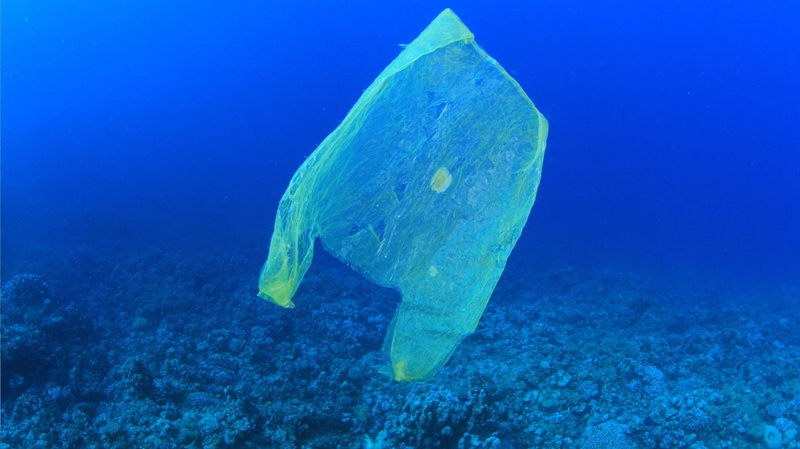

## **Big Idea**: Plastic Pollution
### Whether humans live near the coasts or far inland, they are a part of the problem- and the solution to plastic pollution. Learning and preventing this global crisis at an individual level, could protect our oceans and waterways.

## 3 Minute Story: 

Plastic is a substance that earth cannot digest. In fact, more than 40 percent of plastic is used only once before it is thrown away, where it lingers in the environment for a very long time. The pieces of plastic take decades and centuries to degrade in the ocean. Current estimates show that at last 8 million pieces of plastic are entering the oceans every single day. At current rates, plastic is expected to outweigh all the fish in the sea by 2050. 

From the whale, sea lions, and birds to the microscopic organisms called zooplankton, plastic has been, and is, greatly affecting marine life on shore and offshore. Plastics may form an even bigger threat to coastal populations, particularly in developing countries. 

The United Nations Joint Group of Experts on the Scientific Aspects of Marine Pollution (GESAMP), estimated that land-based sources account for up to 80 percent of the world’s marine pollution, 60 to 95 percent of the waste being plastics debris. 

A full understanding of the magnitude and scope of this plastic pollution starts with clear definitions as to what and why it is happening. It simply starts with individual choices.




<iframe seamless frameborder="0" src="https://public.tableau.com/views/Book1_15874823003510/Sheet1?:embed=yes&:display_count=yes&:showVizHome=no" width="800" height="400" scrolling='yes'> </iframe>

<iframe seamless frameborder="0" src="https://public.tableau.com/views/Book1_15874823003510/Sheet3?:embed=yes&:display_count=yes&:showVizHome=no" width="800" height="500" scrolling='yes'> </iframe>

<iframe seamless frameborder="0" src="https://public.tableau.com/views/Book1_15874823003510/Sheet5?:embed=yes&:display_count=yes&:showVizHome=no" width="800" height="500" scrolling='yes'> </iframe>

<iframe seamless frameborder="0" src="https://public.tableau.com/views/Book1_15874823003510/Sheet6?:embed=yes&:display_count=yes&:showVizHome=no" width="800" height="500" scrolling='yes'> </iframe>

<iframe seamless frameborder="0" src="https://public.tableau.com/views/Book1_15874823003510/Sheet7?:embed=yes&:display_count=yes&:showVizHome=no" width="800" height="500" scrolling='yes'> </iframe>

<iframe seamless frameborder="0" src="https://public.tableau.com/views/Book1_15874823003510/Sheet8?:embed=yes&:display_count=yes&:showVizHome=no" width="800" height="500" scrolling='yes'> </iframe>

<iframe seamless frameborder="0" src="https://public.tableau.com/views/Book1_15874823003510/Sheet9?:embed=yes&:display_count=yes&:showVizHome=no" width="800" height="500" scrolling='yes'> </iframe>

You can use the [editor on GitHub](https://github.com/MakeMyLifeEasy/try/edit/master/README.md) to maintain and preview the content for your website in Markdown files.

Whenever you commit to this repository, GitHub Pages will run [Jekyll](https://jekyllrb.com/) to rebuild the pages in your site, from the content in your Markdown files.

### Markdown

Markdown is a lightweight and easy-to-use syntax for styling your writing. It includes conventions for

```markdown
Syntax highlighted code block

# Header 1
## Header 2
### Header 3

- Bulleted
- List

1. Numbered
2. List

**Bold** and _Italic_ and `Code` text

[Link](url) and 
```

For more details see [GitHub Flavored Markdown](https://guides.github.com/features/mastering-markdown/).

### Jekyll Themes

Your Pages site will use the layout and styles from the Jekyll theme you have selected in your [repository settings](https://github.com/MakeMyLifeEasy/try/settings). The name of this theme is saved in the Jekyll `_config.yml` configuration file.

### Support or Contact

Having trouble with Pages? Check out our [documentation](https://help.github.com/categories/github-pages-basics/) or [contact support](https://github.com/contact) and we’ll help you sort it out.

